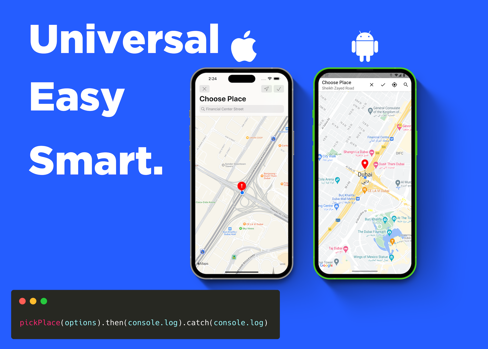

# react-native-place-picker



  <p align="center">
      <a href="https://badge.fury.io/js/react-native-place-picker">
      
    </a>
    <a href="https://github.com/b0iq/react-native-place-picker/actions">
      
    </a>
    <a href="https://github.com/anuraghazra/github-readme-stats/graphs/contributors">
      
    </a>
    <a href="https://codecov.io/gh/b0iq/react-native-place-picker">
      
    </a>
    <a href="https://github.com/b0iq/react-native-place-picker/issues">
      
    </a>
    <a href="https://github.com/b0iq/react-native-place-picker/pulls">
      
    </a>
    <br />
    <br />
  </p>

### How is it working?

> This plugin is built only by create native page `UIViewController` for iOS or `Activity` for Android. and present the page in front of React Native Application without any special dependencies just native code

## Installation

```sh
npm install react-native-place-picker
# or
yarn add react-native-place-picker
```

### Expo

- You need to add `expo-dev-client` and run `expo run:ios` or `expo run:android`

> **Info** Expo managed app not yet supported 🚧

### iOS

- If you want to enable user current location button you have to add this to your `Info.plist`

```xml
<key>NSLocationWhenInUseUsageDescription</key>
<string>YOUR_PURPOSE_HERE</string>
```

### Android ⚠️

- Add to your `AndroidManifest.xml` you Google Map API Key or your application will crash

```xml
<meta-data
   android:name="com.google.android.geo.API_KEY"
   android:value="YOUR_KEY" />
```

## Usage

### Request

```js
import { pickPlace } from 'react-native-place-picker';

pickPlace({
  enableUserLocation: true,
  enableGeocoding: true,
  color: '#FF00FF',
  //...etc
})
  .then(console.log)
  .catch(console.log);

// or

pickPlace().then(console.log).catch(console.log);
```

### Result

```ts

{
    /**
     * @description Selected coordinate.
     */
    coordinate: PlacePickerCoordinate;
    /**
     * @description Geocoded address for selected location.
     * @if `enableGeocoding: true`
     */
    address?: PlacePickerAddress;
    /**
     * @description Did cancel the place picker window without selecting.
     */
    didCancel: boolean;
}

```

## Contributing

See the [contributing guide](CONTRIBUTING.md) to learn how to contribute to the repository and the development workflow.

## License

MIT
